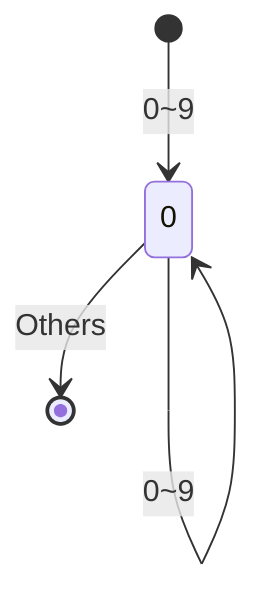
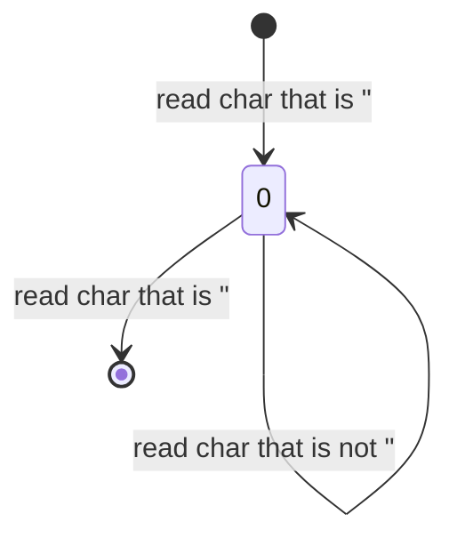

## 编译器前端
### 词法分析器
可以把程序的源代码想象成一大长段的文字， 我们需要将这一大长短的字符流进行分割，
输入的是一段连续的字符，然后吐出来一个一个的单词序列。
而这正是词法分析器的主要作用，需要吸收这些字符流，然后以Token流的形式输出。

这一步我们通常既可以使用手写也可以使用工具来帮我们自动化的生成。
我们以最简单的数字读入为例。 比如字符流为 `12345`。

我们使用下面的状态图来表示一些状态转换，下面则是一个最简单的状态机，它可以帮助我们识别数字。



上面的状态机就表示，如果读入的字符在0~9之间，我们就继续读入，如果不是，则进入终止状态。

如果用代码表示：
```c++
if (isdigit(chr)) {
    do {
        // append char to bufffer
        chr = next_char();
    } while (isdigit(chr));
}
```

这样我们就完成了对数字的识别并且返回一个数字Token。

同理，我们可以用下面图形表示识别形如`"abc"`的文本字面量的状态机。



如果用代码表示：
```c++
if (chr == '"') {
    do {
        // append char to bufffer
        chr = next_char();
    } while (chr != '"');
}
```

说完状态机之后我们要想办法从一个语法中形式化的描述这个东西了，而这个形式化描述这个状态机的语言，
我们叫它正则表达式。

